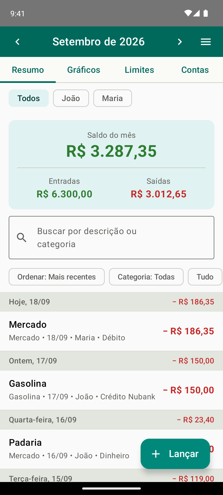
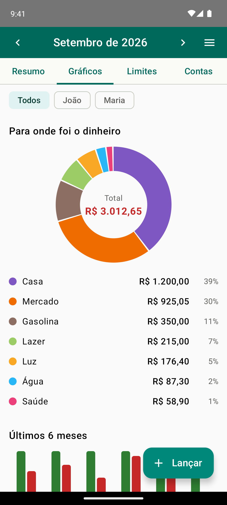
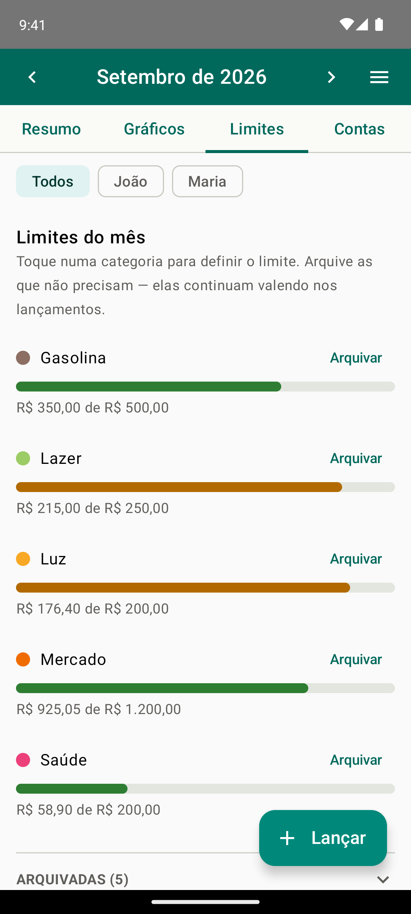
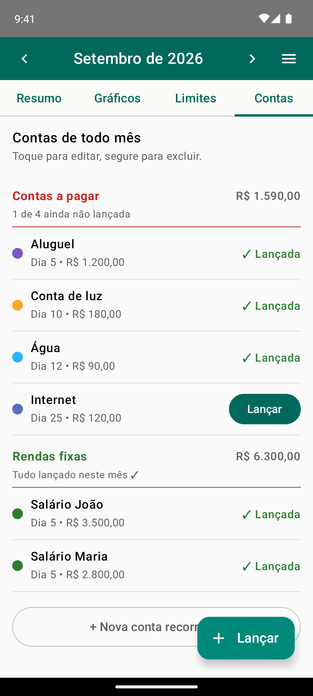
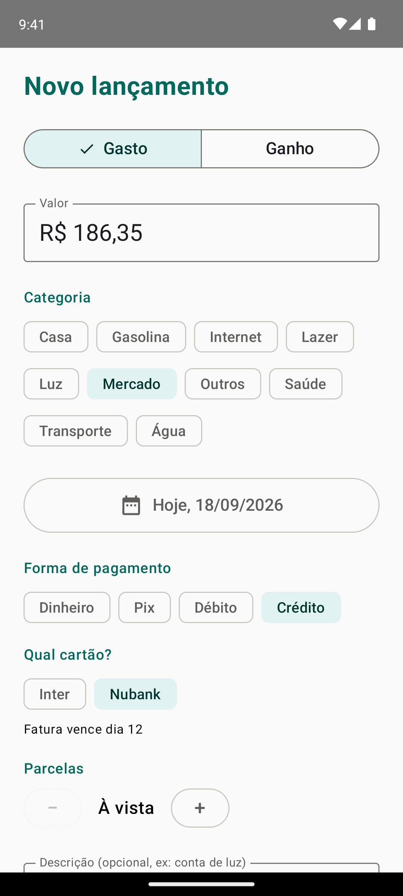
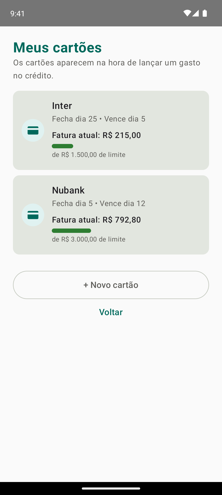

<div align="center">

# 💰 Unicka Finanças

**App Android nativo para uma família organizar dinheiro junta, em tempo real.**

[](https://kotlinlang.org/)
[](https://developer.android.com/jetpack/compose)
[](https://firebase.google.com/)
[](https://m3.material.io/)
[-3DDC84?logo=android&logoColor=white)](#-como-compilar)

</div>

---

## 💡 Por que este projeto existe

Este é um **projeto de estudo com um objetivo real e afetivo**: ajudar meus pais a enxergarem para onde vai o dinheiro da casa.

A conta do mês sempre "não fechava", as despesas ficavam espalhadas na cabeça de cada um, e ninguém tinha uma visão do todo. Eu quis aprender **desenvolvimento Android moderno** — Kotlin, Jetpack Compose e Firebase — construindo algo que a minha própria família fosse usar de verdade.

A ideia central é o **cofre compartilhado da família**: cada pessoa instala o app no seu celular, entra na mesma família com um código, e **todos os lançamentos aparecem para todos na hora**. Assim dá para ver "quem gastou o quê" e somar tudo em um só lugar — sem planilha, sem grupo de WhatsApp, sem depender de uma pessoa só anotando.

> Um exercício prático de app com **sincronização em nuvem, multiusuário e regras de segurança** — mas nascido de uma necessidade concreta de casa.

---

## ✨ Funcionalidades

| Recurso | Descrição |
|---|---|
| 👨‍👩‍👧 **Cofre da família** | Vários membros compartilham as mesmas finanças. Entrou com o código da família → passa a ver e lançar tudo, em tempo real. |
| 💸 **Lançamentos** | Registro de **gastos e ganhos** com valor, categoria, forma de pagamento e data. |
| 🏷️ **Categorias personalizadas** | Cada família cria suas próprias categorias, com **cor** e tipo (gasto, ganho ou ambos). |
| 💳 **Cartões de crédito** | Cadastro de cartões com dia de fechamento, dia de vencimento e limite. |
| 🔁 **Contas recorrentes** | Modelos de contas mensais (luz, água, aluguel...) com valor esperado e dia de vencimento. |
| 🔔 **Lembretes de vencimento** | Notificações automáticas avisando quando uma conta está para vencer (via WorkManager, funciona em segundo plano). |
| 🎯 **Orçamento por categoria** | Define um limite mensal por categoria e acompanha o quanto já foi gasto. |
| 📈 **Gráficos e resumos** | Visão do mês por categoria e forma de pagamento, com busca e filtros. |
| 📤 **Exportação CSV** | Exporta os lançamentos para abrir em Excel / Google Sheets. |

---

## 📱 Telas

<div align="center">

| Resumo | Gráficos | Limites |
|:---:|:---:|:---:|
|  |  |  |
| **Contas** | **Novo lançamento** | **Cartões** |
|  |  |  |

<sub>Prints com dados de exemplo (família fictícia), gerados pelo teste <code>PrintsDivulgacaoTest</code>.</sub>

</div>

---

## 🧱 Stack técnica

- **Linguagem:** Kotlin (100%)
- **UI:** Jetpack Compose + **Material 3** (interface declarativa e moderna)
- **Arquitetura:** MVVM (Model – View – ViewModel) — o estado das telas vive em `mutableStateOf` do Compose e os dados do Firestore chegam como `Flow`
- **Autenticação:** Firebase Authentication (e-mail e senha)
- **Banco de dados:** Cloud Firestore (NoSQL, **sincronização em tempo real** entre os celulares)
- **Tarefas em segundo plano:** WorkManager (lembretes de vencimento)
- **Assíncrono:** Kotlin Coroutines
- **Build de release:** R8 (encolhe e ofusca o código)

### Por que essas escolhas?

- **Firestore** dá a sincronização multiusuário "de graça": um membro lança uma despesa e ela aparece no celular dos outros na hora, sem eu precisar escrever um servidor.
- **Compose + Material 3** deixam a interface limpa e consistente com bem menos código do que o Android "clássico" (XML).
- **Valores em centavos (inteiros)**, nunca em `float`/`double` — evita o erro clássico de arredondamento de dinheiro.

---

## 🗂️ Arquitetura

```
app/src/main/java/com/familia/controledegastos/
├── MainActivity.kt         # entrada do app e navegação
├── model/                  # modelos de dados (Transacao, Categoria, Cartao, Familia...)
├── data/                   # repositórios que falam com o Firestore
├── ui/
│   ├── telas/              # telas em Compose (Login, Principal, Cartões, Categorias...)
│   ├── theme/              # cores, tipografia e tema Material 3
│   ├── AuthViewModel.kt    # estado de autenticação
│   └── TransacoesViewModel.kt
├── notificacoes/           # lembretes de vencimento (WorkManager)
└── export/                 # exportação para CSV
```

A segurança dos dados é garantida pelas **regras do Firestore** (`firestore.rules`): cada pessoa só acessa o próprio perfil e o cofre da família da qual é membro — **todo o resto é negado no servidor**, não só na tela.

### ✅ Testes

- **Unitários (JVM):** lógica pura — por exemplo, o agrupamento dos lançamentos por dia.
- **Instrumentados (Compose UI):** telas exercitadas com dados de mentira, sem precisar de login nem de internet — o agrupamento das contas, arquivar e restaurar limites, a trava que impede excluir uma categoria em uso e os nomes das abas com a fonte do sistema ampliada.
- **Prints de divulgação:** `PrintsDivulgacaoTest` sobe o app de verdade com uma família fictícia, com o Firestore offline (nada chega na nuvem), e fotografa as telas.

```bash
./gradlew testDebugUnitTest          # unitários
./gradlew connectedDebugAndroidTest  # instrumentados (precisa de emulador ou aparelho)
```

---

## 🛠️ Como compilar

Pré-requisitos: **Android Studio** e um dispositivo/emulador com **Android 8.0 (API 26)** ou superior.

Este projeto usa Firebase, então alguns arquivos **não** estão no repositório (por conterem chaves ou segredos) e precisam ser adicionados localmente:

1. **`app/google-services.json`** — baixado do seu projeto no [console do Firebase](https://console.firebase.google.com/).
2. **`local.properties`** — gerado automaticamente pelo Android Studio (aponta para o SDK).
3. **`keystore.properties`** *(só para gerar o APK assinado)* — veja o modelo em [`keystore.properties.exemplo`](keystore.properties.exemplo).

Depois:

```bash
# instalar a versão de debug em um aparelho conectado
./gradlew installDebug

# ou gerar o APK de release assinado
./gradlew assembleRelease
```

---

## 🔒 Segurança & privacidade

- A **chave de assinatura** do app (`*.jks`), as senhas do keystore e o `local.properties` **nunca** foram versionados — estão protegidos pelo `.gitignore` desde o início.
- As regras do Firestore restringem cada dado ao dono ou aos membros da família.
- Relatórios em PDF gerados pelo app (com dados financeiros reais) também ficam fora do controle de versão.

> ⚠️ **Nota:** a chave `.jks` de assinatura deve ser guardada em local seguro e com backup. Perdê-la significa não conseguir mais publicar atualizações do app com a mesma identidade.

---

## 📌 Situação atual

App funcional (versão `1.1.0`), instalado e em uso pela família. Evoluiu a partir do uso real: categorias personalizadas, filtros no resumo, exportação e otimização do build de release surgiram de necessidades que apareceram na prática. A última rodada nasceu de uma semana de teste dos meus pais com o app na mão: lista separada por dia, contas divididas entre o que sai e o que entra, e ajustes para quem usa o celular com fonte grande.

## 📄 Licença

Distribuído sob a **Licença MIT** — você pode usar, estudar, modificar e compartilhar livremente, mantendo o aviso de copyright. Veja o arquivo [LICENSE](LICENSE) para os detalhes.

© 2026 Jhonatan Brum

---

<div align="center">

*Projeto pessoal e de estudo. Desenvolvido com ❤️ para a minha família.*

</div>
